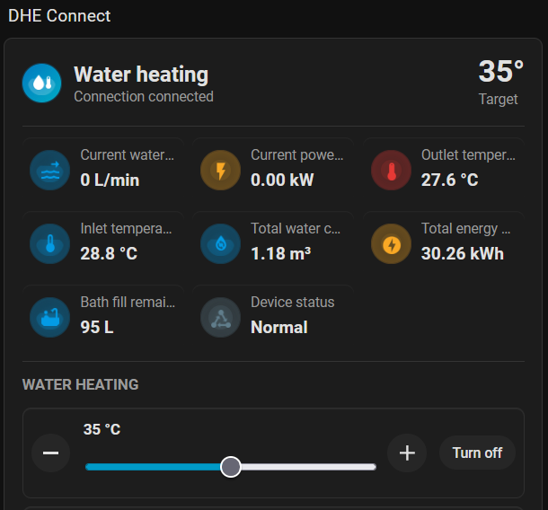

# DHE Connect for Home Assistant (Unofficial)

[](https://github.com/memphi2/ha-dhe-connect/actions/workflows/validate.yml)
[](https://www.hacs.xyz/)
[](LICENSE)

Unofficial local Home Assistant integration for compatible DHE Connect
instantaneous water heaters.

The integration talks directly to the DHE web interface on your local network. It uses the same Socket.IO / Engine.IO v3 protocol shape as the browser UI: polling for session setup and authentication, then a WebSocket upgrade for the persistent runtime connection. No cloud service is used.

## Status

- Current version: `1.6.0`
- Release channel: initial stable release
- Quality target: Home Assistant Quality Scale Silver-oriented validation for a
  custom integration; not an official Home Assistant core certification
- Home Assistant setup: UI config flow
- HACS type: custom integration
- IoT class: local push
- Network target: local DHE web interface, usually port `8443`
- Scope: multiple configured DHE Connect devices per Home Assistant instance

This is a custom integration and should be used on a trusted local network.
The repository is intentionally published as a clean initial release at
`v1.6.0`; earlier development history is not required for installation or
normal operation.

Development and protocol mapping for this release were assisted by OpenAI Codex.

## Legal Notes

This project is an unofficial community integration. It is not affiliated with,
endorsed by, sponsored by or otherwise approved by any device manufacturer,
Home Assistant, HACS or their respective owners.

Product and project names are used only to describe compatibility and the target
ecosystem. The bundled `brand/icon.png` and `brand/logo.png` files are original
project artwork and intentionally do not include vendor logos or copied product
marks.

Unless a file states otherwise, the code, documentation and bundled project
artwork in this repository are licensed under the MIT License. The license does
not grant rights to third-party trademarks, the DHE device firmware, the vendor
web interface or other third-party assets. Vendor JavaScript, CSS, HTML,
firmware, screenshots and product artwork are intentionally not bundled.

Protocol notes in this repository describe observed interoperability behavior
only. They are not a copy of, or a substitute for, any vendor software,
documentation or specification.

See [docs/legal.md](docs/legal.md) for the repository asset and
interoperability hygiene policy.

## Highlights

- Fully local Socket.IO / Engine.IO v3 session with browser-style heartbeat handling, reconnect grace handling and automatic reconnect diagnostics.
- Target temperature control through the DHE ODB command interface, including Climate limits that respect the physical `Tmax` jumper and the active child-safety limit.
- Temperature memory controls for all 12 supported slots; slots 3 to 12 are disabled by default.
- Eco mode, Eco flow limit, bath fill, child safety, wellness controls with DHE-provided program metadata, brush timer and shower timer controls.
- Current water flow, current power, total water and total energy consumption sensors are enabled by default; ODB saving, last usage, timer and saving-monitor sensors start disabled to keep the device card tidy.
- Compact radio media player for station metadata, current title, short-description fallback, playback, volume and favorites.
- Options-flow radio search by full text, DHE genre catalog, country catalog or city catalog.
- Weather entity for the DHE forecast payload with favorite location selection.
- General diagnostic status, reconnect count, connection details, scald-protection diagnostics, ODB protocol diagnostics, device information and a diagnostic text field for the DHE device name.

## Optional Dashboard Card

For a richer Lovelace dashboard, use the companion
[DHE Connect Card](https://github.com/memphi2/ha-dhe-connect-card). The card
discovers the entities created by this integration and presents water heating,
live consumption, bath fill, timers, temperature memories, weather, radio and
diagnostics in a compact Mushroom-style layout.



## Documentation

| Topic | Document |
|---|---|
| Installation and normal use | This README |
| German quick guide | [docs/de.md](docs/de.md) |
| Entity list, attributes and service examples | [docs/entities.md](docs/entities.md) |
| Pairing, connectivity and recorder troubleshooting | [docs/troubleshooting.md](docs/troubleshooting.md) |
| Tested device and firmware matrix | [docs/firmware_matrix.md](docs/firmware_matrix.md) |
| Protocol and ODB mapping notes for maintainers | [docs/protocol.md](docs/protocol.md) |
| Local tests, HA smoke checks and release-readiness flow | [docs/validation.md](docs/validation.md) |
| Security and token-handling notes | [SECURITY.md](SECURITY.md) |

## Installation

### HACS custom repository

1. Open HACS.
2. Go to `Integrations`.
3. Open the three-dot menu and choose `Custom repositories`.
4. Add this repository URL:

   ```text
   https://github.com/memphi2/ha-dhe-connect
   ```

5. Select category `Integration`.
6. Install `DHE Connect`.
7. Restart Home Assistant.
8. Add the integration from `Settings` -> `Devices & services`.

### Manual installation

Copy the integration directory to:

```text
/config/custom_components/stiebel_dhe_connect/
```

After copying, restart Home Assistant and add `DHE Connect` from the UI.

### Removal

1. In Home Assistant, open `Settings` -> `Devices & services`.
2. Open the `DHE Connect` integration entry.
3. Use the three-dot menu and choose `Delete`.
4. Restart Home Assistant if you want to remove the custom integration files.
5. For manual installations, delete
   `/config/custom_components/stiebel_dhe_connect/` after the integration entry
   has been removed.

Pairing tokens are stored per config entry under Home Assistant storage. Remove
only the matching token file if you are cleaning up a failed manual test; normal
integration removal should be done from the Home Assistant UI first.

### Custom artwork

The integration ships original, project-local PNG artwork:

```text
/config/custom_components/stiebel_dhe_connect/brand/icon.png
/config/custom_components/stiebel_dhe_connect/brand/logo.png
```

To use different local artwork, replace those files with PNGs using the same filenames, then restart Home Assistant and refresh the browser cache if the old artwork is still shown. HACS or manual updates can overwrite the files, so keep a copy of custom artwork and reapply it after updating if needed.

## Configuration

When the integration is added, Home Assistant starts with one setup-method
selector:

- Discovered DHE Connect devices from Zeroconf/mDNS, when Home Assistant has
  received `_ste-dhe._tcp.local.` advertisements.
- `Subnet scan`, which checks the selected private IPv4 subnet for DHE-like web
  interfaces. The scan-port field defaults to `8443`.
- `Enter manually`, for direct host/IP setup.

The subnet fields are shown only after `Subnet scan` is selected. The scan can
use the current local subnet, network address plus subnet mask such as
`192.168.1.0` and `255.255.255.0`, or CIDR notation such as
`192.168.1.0/24`. Home Assistant pre-fills custom subnet forms from its current
local subnet when possible. If a candidate is found, the normal setup form opens
with host and port pre-filled. If no candidate is found, the same form opens for
manual entry.

Keep the scan port at `8443` unless the DHE web interface has been configured
to listen on another port. The scan port only affects setup-time subnet scans;
Zeroconf discoveries and manual setup use the port reported or entered for that
target.

Zeroconf/mDNS discovery only works inside the local subnet/VLAN by default.
Discovery across subnets needs a router or firewall that is explicitly
configured to reflect or relay mDNS traffic. A direct `.local` hostname lookup
or direct unicast DNS-SD answer from the DHE is not enough for Home Assistant's
Zeroconf flow; Home Assistant must receive the multicast DNS-SD advertisement.
If the DHE Connect is reachable but not discovered automatically, use the manual
host/IP setup or the explicit subnet scan for that network.

Discovery state is cached temporarily in Home Assistant storage. The cache does
not replace pairing and does not create a device by itself; it helps avoid
repeated automatic prompts after restarts, keeps recent discoveries selectable
from the user-started setup flow, and exposes anonymized discovery health in
diagnostics. Discovery records track source, first/last seen timestamps,
confidence, preferred identity source and conflicting identity hints. Set
`DHE_CONNECT_DISCOVERY_DEBUG=1` only while debugging discovery behavior; debug
logs still avoid printing raw tokens but can increase log volume.
The diagnostics also summarize cache state, cache age, Zeroconf record age and
prompt-suppression status without exposing hosts, IP addresses or service names.

Support diagnostics also include a compact device summary with the DHE-reported
device type, web-interface protocol version and the first 7 characters of the
product ID, plus reconnect-supervisor state and runtime parser category counts.
Full product IDs, MAC addresses, hosts and tokens are redacted or reduced to
presence flags.

The local Home Assistant device page can still expose the full product ID as a
disabled diagnostic sensor for the owner, and the DHE device name can be changed
through a diagnostic text entity.

The config flow asks for:

| Field | Example | Notes |
|---|---|---|
| Host | `dhe.local` | IP address or hostname only |
| Port | `8443` | DHE web interface port |
| Device name | `DHE Connect` | Name shown in Home Assistant |
| Internal scald protection (Tmax jumper) | `60` | Physical `Tmax` jumper position; options are `43`, `50`, `55`, `60` and `no_jumper` |

The host field intentionally rejects URLs with paths, usernames, query strings or embedded ports. The port must be between `1` and `65535`.

On first connection Home Assistant validates the DHE pairing before the
integration entry is created. Zeroconf, subnet scan and manual setup all use the
same pairing-confirm step; after successful pairing the config entry unique ID
uses the paired device MAC address when the DHE reports one.

### Multiple devices

Add one config entry per DHE device:

1. `Settings` -> `Devices & services` -> `Add integration` -> `DHE Connect`
2. Enter host, port, name and physical `Tmax` jumper position for that exact DHE
3. Complete pairing on the device display (required)
4. Repeat for the next DHE

Each config entry keeps its own runtime session, token file and entity set.

### First pairing flow

1. Add `DHE Connect` from `Settings` -> `Devices & services`.
2. Enter the DHE host/IP, port, a provisional device name and the physical `Tmax` jumper position.
3. Submit the form, then click `OK` on the pairing confirmation step.
4. Confirm the pairing request on the DHE device display and complete the confirmation there (required).
5. Home Assistant creates the integration entry only after pairing and login have completed.
6. Assign the device to an area and adjust entity names as desired.

## Pairing token

After successful pairing the local token is stored per configured DHE target at:

```text
/config/.storage/stiebel_dhe_connect_token_<host>_<port>.txt
```

With multiple DHE devices, each host/port pair gets its own token file.
For very long hostnames, the token filename uses a bounded host component with a hash suffix to avoid filesystem filename-length errors.
During explicit setup pairing, stale legacy-shaped or entry-id based token files that do not belong to an existing DHE config entry are removed before a fresh token is requested.

Use the disabled-by-default `Repair pairing` button if you want to force a new pairing from Home Assistant.
The button deletes the stored token, reconnects and shows a pairing notification while the DHE waits for confirmation.
If pairing fails repeatedly, the integration pauses automatic retries after three attempts; use `Repair pairing` again after checking the DHE.
If the DHE rejects a stored token during normal runtime, Home Assistant starts
the integration reauthentication flow and asks for a fresh on-device pairing
confirmation.
Manual token deletion is only needed if Home Assistant cannot load the integration far enough to expose the button.

The integration attempts to store the token file with `0600` permissions where the Home Assistant filesystem supports it.

## Entities

The integration creates one Home Assistant device per configured DHE target and exposes a focused default set:

- Climate target temperature with `heat`/`off` support.
- Radio media player with favorites as selectable sources.
- Weather entity and weather-location select for DHE forecast favorites.
- Current water flow, current power and water/energy consumption totals enabled by default for Home Assistant dashboards.
- Additional live telemetry, saving-monitor, diagnostic, timer, memory and protocol entities disabled by default to keep the device page manageable.

The full entity table, attributes, service examples and underlying DHE sources live in [docs/entities.md](docs/entities.md).

## Water dashboard support

The three water consumption sensors are exposed as real Home Assistant water meters:

- `device_class=water`
- `state_class=total_increasing`
- units `L` or `m3`

This allows them to be used in the Home Assistant energy/water dashboard after you enable the desired disabled-by-default consumption entities. Home Assistant may need up to two hours before newly added long-term statistics entities appear in dashboard pickers.

## Protocol reference

The README keeps user-facing setup and entity behavior in one place. The lower-level Socket.IO, Engine.IO, ODB startup-read and conversion details live in [docs/protocol.md](docs/protocol.md).

That reference also documents the high-churn recorder throttling rules used for live temperature, saving-monitor and ODB payload updates.

## Availability and reconnect behavior

The client runs a single persistent session loop. Home Assistant entities subscribe to cached setpoint, measurement, online, availability and reconnect callbacks. When an entity is added after a value was already received, the current cached value is delivered immediately.

Short runtime drops stay inside a small reconnect grace window. During that window cached entities remain available while the `Connection state` diagnostic sensor reports `reconnecting`. If the grace window expires, live entities become unavailable until fresh runtime data is received again.

Diagnostic sensors expose the current client connection state, reconnect count, next reconnect delay (`0 s` while connected) and the last reconnect reason. These are intended for troubleshooting connection stalls, WebSocket churn and device-side session closes without adding volatile reconnect details to normal entity attributes.

## Validation

For day-to-day development, run:

```bash
python scripts/check_integration.py
```

It checks the manifest, HACS metadata, required repository files, release-note source of truth, translation key parity and Python syntax without writing bytecode artifacts. The same check runs in the `Validate` GitHub Actions workflow.

The full validation and release-readiness flow, including type checks, fake-DHE tests, Home Assistant fixture tests, mounted HA smoke checks and release checks, lives in [docs/validation.md](docs/validation.md).

Release candidates should also pass the optional real Zeroconf/mDNS smoke gate
from the release-lab network where the DHE advertisement is expected to be
visible:

```bash
python scripts/zeroconf_smoke.py --timeout 20
```

This is not a universal CI check. It depends on local multicast visibility and
can fail in VLAN or firewall setups even when the integration code is correct.

## Security notes

- Use only on a trusted local network.
- Do not expose the DHE web interface or port `8443` to the internet.
- The pairing token is stored under Home Assistant's configuration directory.
- Tokens are not intentionally written to normal logs.
- Diagnostic and validation helpers redact private host, token and credential context before printing command or smoke-test failures.
- Treat Home Assistant backups and mounted config directories as sensitive because they can contain integration tokens.
- See [SECURITY.md](SECURITY.md) for token storage, redaction and reporting details.

## Troubleshooting

For detailed pairing, connectivity, recorder, favorites, memory-slot and debug-log guidance, see [docs/troubleshooting.md](docs/troubleshooting.md). Start there before deleting tokens or recreating entries.

| Symptom | Check |
|---|---|
| Integration cannot connect | Verify host, port and browser access to `http://<host>:<port>/` |
| Device or entity registry looks stale after testing development builds | Remove the DHE Connect integration entry/device and add it again once so Home Assistant rebuilds the registry with normalized object IDs |
| Add flow says already configured | Another DHE Connect config entry already uses the same host/port target. Stale token files alone should not cause this |
| Service call hits the wrong DHE | In multi-device setups always include `entry_id` in service data |
| Pairing repeats | Enable and use the disabled-by-default `Repair pairing` button first. During setup, stale legacy token files are removed automatically; if needed, delete matching `/config/.storage/stiebel_dhe_connect_token*.txt` files and pair again |
| Entities stay unavailable | Check the `Connection state` / `Error status` diagnostic sensors and Home Assistant logs for DHE session errors |
| Reconnect counter increases often | Confirm the WebSocket connection is not blocked and no second client is fighting for the DHE session |
